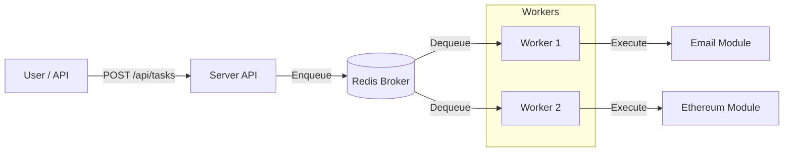

# GopherTask 🚀

**GopherTask** is a high-performance, modular, and distributed task queue system built with **Go** and **Redis**. It is designed to handle asynchronous background jobs with reliability, ease of use, and extensibility in mind.

Features a real-time **Dashboard** to monitor queue depth, active workers, and job statuses.


## 🌟 Features

*   **Distributed Architecture**: Scale your workers horizontally across multiple servers.
*   **Modular Design**: "Plug-in" style architecture. Easily add new job types (e.g., Blockchain, Email, AI processing) by implementing a simple interface.
*   **Reliable**: At-least-once delivery guarantees using Redis lists and atomic operations.
*   **Real-time Dashboard**: Built-in React UI to visualize system health and trigger jobs manually.
*   **Fault Tolerance**: Automatic retries and error handling.

## 🏗️ Architecture

The system consists of three main components:

1.  **Broker (Redis)**: The central message broker that manages queues and task states.
2.  **Server (Producer/API)**: Accepts HTTP requests to enqueue tasks and serves the Dashboard UI.
3.  **Worker (Consumer)**: Intelligent agents that pull tasks from the queue and execute the corresponding **Module**.



## 🚀 Getting Started

### Prerequisites

*   Go 1.22+
*   Redis (Local or Docker: `docker run -p 6379:6379 -d redis`)

### Installation

Clone the repository:

```bash
git clone https://github.com/yourusername/gophertask.git
cd gophertask
go mod download
```

### Running the System

You need two terminal windows to run the full system.

**1. Start the Server (API & Dashboard)**
```bash
go run ./cmd/server
# Server running on http://localhost:8080
```

**2. Start the Worker**
```bash
go run ./cmd/worker
# 🚀 Worker started with modules: email:send, ethereum:check_balance
```

Visit **http://localhost:8080** in your browser to see the Dashboard.

## 🧩 Default Modules

GopherTask comes with example modules to showcase its capabilities:

*   **📧 Email Module (`email:send`)**: Simulates sending emails with random network latency and failure injection for testing reliability.
*   **💎 Ethereum Module (`ethereum:check_balance`)**: Connects to a real Public Ethereum RPC node to fetch the live balance of a wallet address (wei).

## 🛠️ Creating a New Module

Adding a new capability is easy. Just implement the `Module` interface:

```go
// internal/modules/interface.go
type Module interface {
    ID() string
    Handle(ctx context.Context, payload json.RawMessage) error
}
```

**Example: A 'Resize Image' Module**

1.  Create `internal/modules/resize.go`:
```go
type ResizeModule struct{}

func (m *ResizeModule) ID() string { return "image:resize" }

func (m *ResizeModule) Handle(ctx context.Context, payload json.RawMessage) error {
    // Your logic here
    return nil
}
```

2. Register it in `cmd/worker/main.go`:
```go
proc.Register("image:resize", &modules.ResizeModule{}.Handle)
```

## 📜 License

MIT License.
